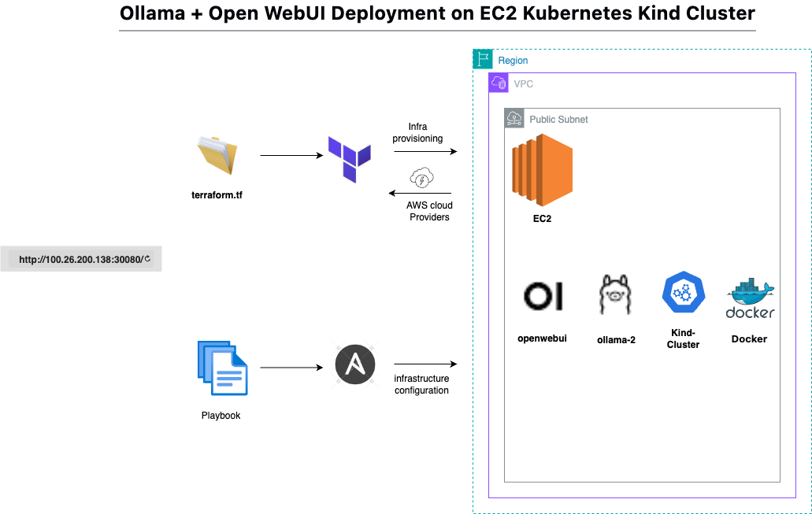

# Ollama + Open WebUI Deployment on EC2 Kubernetes Kind Cluster

## Overview
This project automates the complete deployment of Open WebUI connected with Ollama (Llama 2) on a Kubernetes cluster running inside an AWS EC2 instance. It leverages Terraform for infrastructure provisioning and Ansible for application deployment, providing a one-click reproducible environment.

**Note:** This setup uses Kind (Kubernetes in Docker) because of AWS free tier limitations. For production deployments, consider using EKS with GPU instances for better performance.

## Architecture
- Terraform provisions an EC2 instance on AWS
- Userdata installs Docker, Kind, and kubectl automatically
- Ansible connects to EC2 and sets up a Kind-based Kubernetes cluster
- Ansible deploys Ollama and Open WebUI pods and services
- Open WebUI connects internally to Ollama (via service DNS) and exposes the interface to the internet


## Tech Stack
- Infrastructure & Cloud Setup(Ec2)
- Cloud Provider: AWS
- Instance Type: t3.medium (2 vCPUs, 4 GB RAM)
- Storage: 200 GB EBS Volume (extended using growpart + resize2fs)
- Provisioning: Terraform (with User Data to install Docker, Kind, and kubectl)
- Configuration Management: Ansible
- Container Orchestration: Kubernetes (Kind Cluster) with Ansible
- LLM Hosting: Ollama (lightweight model server for Llama 2)
- Frontend UI: Open WebUI (connected to Ollama via internal service)
- Namespace: ai-deployment
- Storage Type: Shared Persistent Volume Claim (ollama-shared-pvc)
- Networking: NodePort Service for external OpenWebUI access

## Project Structure
```
.
├── Ansible
│   ├── README.md
│   ├── ai_ec2_key.pem
│   ├── ansible-playbook.yml
│   ├── hosts.ini
│   └── volums-size-issue .png
├── LICENSE
├── OpenWebUI.png
├── README.md
├── Terraform
│   ├── README.md
│   ├── infra-done.png
│   ├── main.tf
│   ├── outputs.tf
│   ├── terraform.tfstate
│   ├── terraform.tfstate.backup
│   └── variables.tf
├── ai_ec2_key.pem
├── k8s-Deployment
│   ├── README.md
│   ├── kind-config.yml
│   ├── ollama-deploy.yml
│   ├── ollama-shared-pvc.yaml
│   └── openwebui-deploy.yml
└── kind-cluster
    ├── README.md
    └── install.sh
```

## Prerequisites
- Terraform installed
- Ansible installed
- AWS CLI configured
- SSH key pair for EC2

## Deployment Steps

### Step 1: Provision Infrastructure
```bash
cd Terraform
terraform init
terraform apply -auto-approve
```
Terraform provisions:
- EC2 instance
- Security groups (SSH, HTTP, Ollama, Open WebUI)
- Userdata script that installs Docker, Kind, and kubectl

### Step 2: Configure Ansible
Update `Ansible/hosts.ini` with your EC2 IP:
```ini
[webservers]
EC2_PUBLIC_IP ansible_user=ubuntu ansible_ssh_private_key_file=../ai_ec2_key.pem ansible_ssh_common_args='-o StrictHostKeyChecking=no'
```


### Step 3: Deploy Applications
```bash
cd ../Ansible
ansible-playbook -i hosts.ini ansible-playbook.yml
```

This playbook:
- Verifies EC2 connectivity
- Creates a Kind cluster
- Deploys Ollama and Open WebUI using manifests from `k8s-Deployment/`

### Step 4: Access the Application
Get the NodePort:
```bash
kubectl get svc openwebui -n ai-deployment
```
Access URL: `http://<EC2_PUBLIC_IP>:<NODEPORT>`


## Verification

### Check Pod Status
```bash
kubectl get pods -n ai-deployment
```

### Test Ollama Connection
```bash
kubectl exec -it deploy/openwebui -n ai-deployment -- curl http://ollama:11434/api/tags
```
You should see a list of models (e.g., llama2:latest).

### Check Loaded Models
```bash
kubectl exec -it deploy/ollama -n ai-deployment -- ollama list
```

## Key Components

| Component | Description |
|-----------|-------------|
| Terraform/main.tf | Defines AWS infrastructure |
| Terraform/userdata.sh | Bootstraps Docker + Kind |
| Ansible/playbook.yml | Automates deployment on EC2 |
| k8s-Deployment/*.yml | Kubernetes manifests for Ollama & Open WebUI |
| kind-cluster/install.sh | Helper script for Kind setup |

## Common Issues & Solutions

### Docker Permission Denied
```bash
sudo usermod -aG docker $USER
newgrp docker
```

### Cluster Connectivity Errors
Check `kind-config.yml` has correct API server bindings:


### Ollama-WebUI Connection Failed
Verify service URL in Open WebUI environment:
```bash
kubectl set env deployment/openwebui -n ai-deployment \
  OLLAMA_API_BASE_URL=http://ollama.ai-deployment.svc.cluster.local:11434
```

### Disk Space Full
```bash
# Resize EBS volume in AWS Console, then:
sudo growpart /dev/xvda 1
sudo resize2fs /dev/xvda1
```

## Debug Commands
```bash
# View all resources
kubectl get all -n ai-deployment

# Check logs
kubectl logs -f deploy/ollama -n ai-deployment
kubectl logs -f deploy/openwebui -n ai-deployment

# Describe pod
kubectl describe pod <pod-name> -n ai-deployment
```

## Production Considerations
This setup is designed for **development/testing with AWS free tier**. For production:

- **Use EKS instead of Kind** for better reliability and scalability
- **GPU instances** (p3.2xlarge or g4dn.xlarge) for faster inference
- **TLS/SSL** with cert-manager and Let's Encrypt
- **LoadBalancer** instead of NodePort
- **Network Policies** for pod security
- **Monitoring** with Prometheus and Grafana
- **Backup strategy** for persistent volumes

## Why Kind?
Kind is used here because:
- AWS free tier doesn't support EKS
- Single EC2 instance deployment
- Quick setup for learning and development
- No additional costs

For production workloads, migrate to EKS with GPU support for optimal performance.

## License
MIT License

---
**Built for AWS free tier • Perfect for learning Kubernetes and AI deployments**
